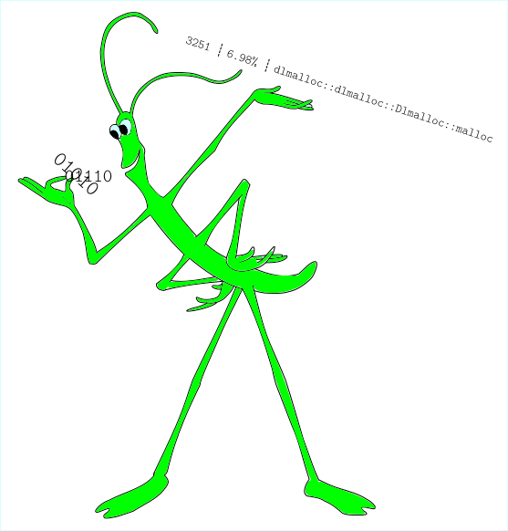

<meta charset="utf-8"/>

# Twiggy🌱

[](https://docs.rs/twiggy/)
[](https://crates.io/crates/twiggy)
[](https://crates.io/crates/twiggy)
[](https://travis-ci.org/rustwasm/twiggy)

**`twiggy` is a code size profiler.**

It analyzes a binary's call graph to answer questions like:

* Why was this function included in the binary in the first place?

* What is the *retained size* of this function? I.e. how much space would be
  saved if I removed it and all the functions that become dead code after its
  removal.

Use `twiggy` to make your binaries slim!

## Install Twiggy

Ensure that you have [the Rust toolchain installed](https://www.rust-lang.org/),
then run:

```
cargo install twiggy
```

## Learn More!

[**Read the Twiggy guide!**](https://rustwasm.github.io/twiggy)

--------------------------------------------------------------------------------


