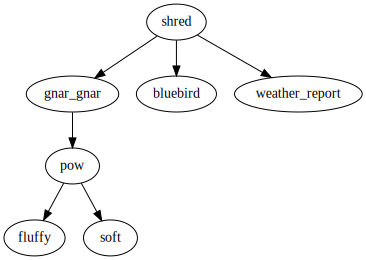

# Dominators and Retained Size

Let's continue to use this example call graph:

Imagine the `pow` function itself might is not very large. But it calls
functions `soft` and `fluffy`, both of which are **huge**. And they are both
*only* called by `pow`, so if `pow` were removed, then `soft` and `fluffy` would
both become dead code and get removed as well. Therefore, `pow`'s "real" size is
huge, even though it doesn't look like it at a glance.

The *dominator* relationship gives us a way to reason about the *retained size*
of a function.

In a graph that is rooted at vertex *R*, vertex *A* is said to
[*dominate*][dominators] vertex *B* if every path in the graph from *R* to *B*
includes *A*. It follows that if *A* were removed from the graph, then *B* would
become unreachable.

In our call graphs, the roots are the `main` function (for executables) or
publicly exported functions (for libraries).

*V* is the *immediate dominator* of a vertex *U* if *V != U*, and there does not
exist another distinct vertex *W* that is dominated by *V* but also dominates
*U*. If we take all the vertices from a graph, remove the edges, and then add
edges for each immediate dominator relationship, then we get a tree. Here is the
dominator tree for our call graph from earlier, where `shred` is the root:

Using the dominator relationship,
[`twiggy` can](../usage/command-line-interface/dominators.md) help you find the
*retained size* of some function by taking its shallow size and adding the
retained sizes of each function that it immediately dominates.

[dominators]: https://en.wikipedia.org/wiki/Dominator_(graph_theory)
