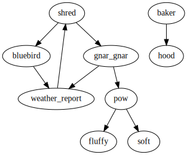

# Paths

If there is a *path* where *A → B → ... → C* through the [call
graph](./call-graph.md), then we say that *C* is *reachable* through from
*A*. *Dead code* is code that is not *reachable* in the call graph from any
publicly exported functions (for libraries) or the `main` function (for
executables).

Recall our example call graph:

Imagine that `shred` was our executable's `main` function. In this scenario,
there is no path through the call graph from `shred` to `baker` or `hood`, so
they are dead code. We would expect that the linker would remove them, and they
wouldn't show up in the final binary.

But what if some function that you *thought* was dead code is appearing inside
your binary? Maybe it is deep down in some library you depend on, but inside a
submodule of that library that you aren't using, and you wouldn't expect it to
be included in the final binary.

In this scenario, [`twiggy` can show](../usage/command-line-interface/paths.md)
you all the paths in the call graph that lead to the unexpected function. This
lets you understand why the unwelcome function is present, and decide what you
can do about it. Maybe if you refactored your code to avoid calling *Y*, then
there wouldn't be any paths to the unwelcome function anymore, it would be dead
code, and the linker would remove it.
